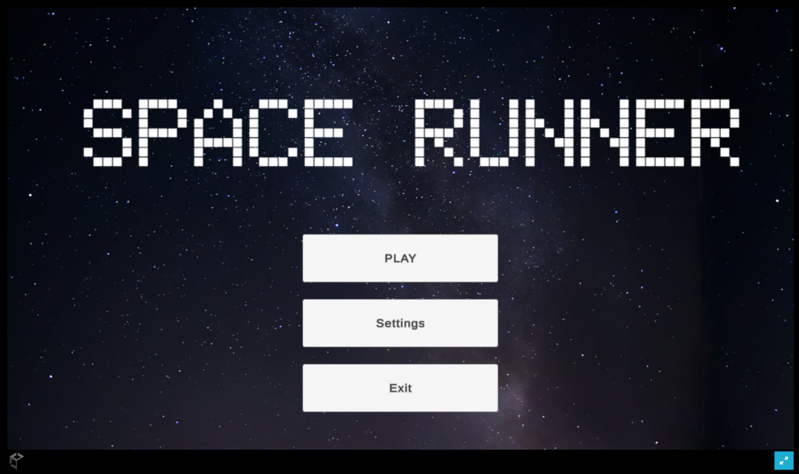
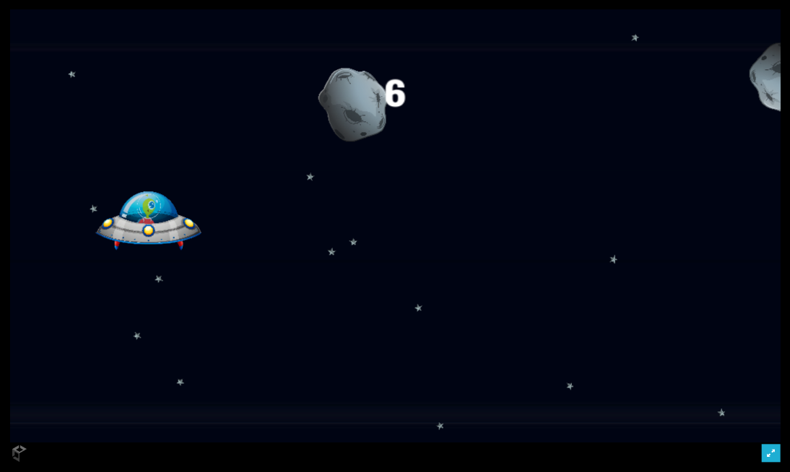
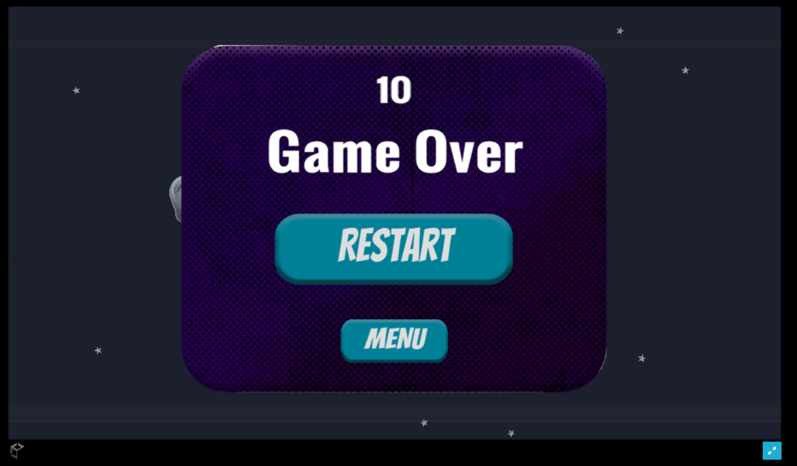

# Space Runner

Welcome to **Space Runner**! 🚀

**Space Runner** is an exciting, fast-paced game where your reflexes are put to the test. Your mission: navigate through a field of asteroids and achieve the highest score possible. Can you handle the challenge?

## 🕹️ How to Play

- **Objective:** Avoid the asteroids and survive as long as you can.
- **Scoring:** Your score increases every second you stay alive.
- **Difficulty:** The game gets harder as your score climbs.

## 🎮 Features

- **Endless Gameplay:** The game continues to get more challenging as you score higher.
- **Increasing Difficulty:** The longer you survive, the tougher the game becomes.
- **Simple Controls:** Focus on dodging asteroids and achieving a high score!

## 🔗 Play the Game

[Play Space Runner on itch.io](https://rtms.itch.io/space-runner)

## 🛠️ Source Code

Want to see how it all works or contribute to the project? Check out the source code on [Google Drive](drive link).

## 📷 Screenshots

## 💬 Feedback & Support

We'd love to hear your feedback! Feel free to reach out with suggestions or report any issues.

- **Email:** your-rtmsinnovations@gmail.com
- **Itch.io Comments:** Leave a comment on the game's [itch.io page](https://rtms.itch.io/space-runner)

## 👥 Meet the Team

- **RICHARD B MELATH** 
- **THOMAS ELDHOSE** 
- **MADHAVAN V**
- **SARANG R** 

Thank you for playing and supporting **Space Runner**! 🚀
